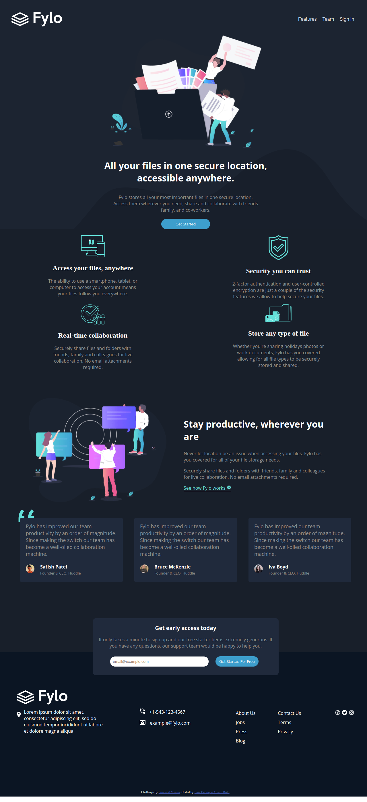

# Frontend Mentor - Fylo dark theme landing page solution

This is a solution to the [Fylo dark theme landing page challenge on Frontend Mentor](https://www.frontendmentor.io/challenges/fylo-dark-theme-landing-page-5ca5f2d21e82137ec91a50fd).

## Table of contents

- [Overview](#overview)
  - [The challenge](#the-challenge)
  - [Screenshot](#screenshot)
  - [Links](#links)
- [My process](#my-process)
  - [Built with](#built-with)
  - [What I learned](#what-i-learned)
  - [Continued development](#continued-development)
- [Author](#luizamaro11)

## Overview

### The challenge

Users should be able to:

- View the optimal layout for the site depending on their device's screen size
- See hover states for all interactive elements on the page

### Screenshot

### Links

- Solution only on local machine

## My process

### Built with

- Semantic HTML5 markup
- CSS custom properties
- Flexbox
- CSS Grid
- Mobile-first workflow
- responsive CSS with media query

### What I learned

I used this challenge to further improve my skills as a front-end developer.

### Continued development

As a continuation of my studies, I intend to take challenges with css animations and their keyframes.

And also develop web pages using javascript for DOM manipulation and among other things.

## Author

- github - [@luizamaro11](https://github.com/luizamaro11)
- Frontend Mentor - [@luizamaro11](https://www.frontendmentor.io/profile/luizamaro11)
